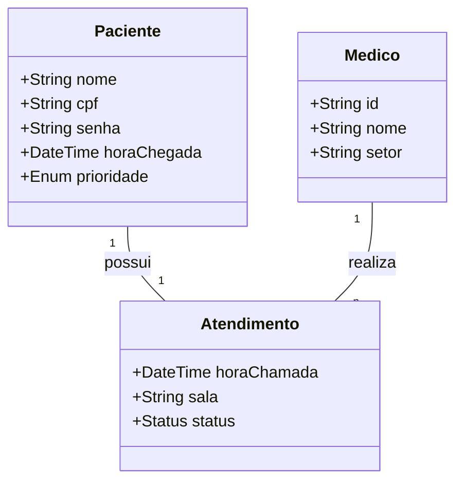
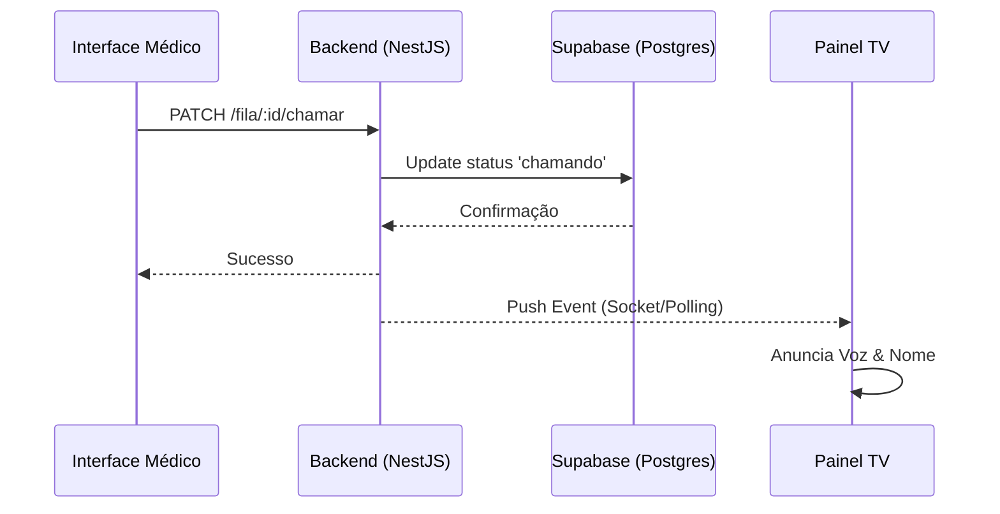

# 📖 Documentação Completa de Engenharia: Projeto Totem NGA

## 1. Visão Geral do Sistema
O **Totem NGA** é uma solução de gestão de fluxo de pacientes projetada para otimizar o atendimento ambulatorial. O sistema integra a identificação no totem, a triagem por prioridade, chamadas visuais e sonoras (TV) e o gerenciamento médico, fornecendo métricas de desempenho em tempo real.

---

## 2. Levantamento de Requisitos

### 2.1. Requisitos Funcionais (RF)
| ID | Descrição |
| :--- | :--- |
| **RF01** | O sistema deve permitir que o paciente se identifique por CPF ou Nome no Totem. |
| **RF02** | O sistema deve emitir uma senha única baseada na categoria de atendimento (Geral, Prioritário). |
| **RF03** | O sistema deve exibir em tempo real a lista de pacientes no Painel da TV. |
| **RF04** | O sistema deve emitir um aviso sonoro (TTS - Text to Speech) ao chamar um paciente. |
| **RF05** | O médico deve conseguir visualizar a fila de pacientes de seu setor. |
| **RF06** | O médico deve ter a funcionalidade de chamar, re-chamar ou finalizar o atendimento de um paciente. |
| **RF07** | O administrador deve visualizar o Tempo Médio de Espera (TME) e KPIs de desempenho. |
| **RF08** | O sistema deve permitir o reset do banco de dados e limpeza de logs operacionais. |

### 2.2. Requisitos Não Funcionais (RNF)
| ID | Descrição |
| :--- | :--- |
| **RNF01** | **Performance:** A chamada do paciente na TV deve ocorrer em menos de 2 segundos após o comando médico. |
| **RNF02** | **Disponibilidade:** O sistema deve operar em alta disponibilidade (SLA 99.9%) via Vercel/Render. |
| **RNF03** | **Segurança:** O banco de dados PostgreSQL deve ser acessível apenas via conexões autenticadas e criptografadas. |
| **RNF04** | **Escalabilidade:** A arquitetura deve suportar múltiplos setores simultâneos (Enfermagem, Médicos, Exames). |
| **RNF05** | **UX/UI:** A interface do totem deve ter botões grandes para fácil interação tátil. |

---

## 3. Regras de Negócio (RN)
1. **RN01 - Prioridade:** Pacientes com prioridade (Idosos, PCD, Gestantes) devem obrigatoriamente aparecer no topo da fila, ordenados por hora de chegada.
2. **RN02 - Chamada Repetida:** Um paciente pode ser chamado até 3 vezes. Após isso, o médico pode marcá-lo como "Não Compareceu" ou retornar à fila.
3. **RN03 - Persistência:** Dados de atendimento do dia anterior devem ser mantidos como Log Operacional para fins estatísticos, mesmo após o reset da fila.
4. **RN04 - Identificação Unificada:** O CPF deve ser validado (formatação) para evitar duplicidade de senhas no mesmo dia para o mesmo paciente.

---

## 4. Diagramas UML (Representação Mermaid)

### 4.1. Diagrama de Casos de Uso
```mermaid
useCaseDiagram
    actor Paciente
    actor Medico
    actor Administrador
    
    Paciente --> (Emitir Senha)
    Paciente --> (Identificar-se)
    
    Medico --> (Visualizar Fila)
    Medico --> (Chamar Paciente)
    Medico --> (Finalizar Atendimento)
    
    Administrador --> (Ver Estatísticas)
    Administrador --> (Resetar Sistema)
    (Chamar Paciente) ..> (Atualizar TV) : <<include>>
```

### 4.2. Diagrama de Classes (Domínio)


### 4.3. Diagrama de Sequência (Chamada de Paciente)


---

## 5. Arquitetura Técnica
- **Arquitetura:** Monorepo System.
- **Frontend:** Next.js 15 (React 19) com Tailwind CSS.
- **Backend:** NestJS com Injeção de Dependências.
- **Persistência:** Prisma ORM sobre PostgreSQL.
- **Infraestrutura:** 
    - Frontend: Vercel (Edge Network).
    - Backend: Render (Web Service).
    - Database: Supabase (Managed Postgres).

---

## 6. Modelo de Dados (Entidades Principais)

### Tabela `pacientes_fila`
- `id`: UUID (Primary Key)
- `nome`: String
- `cpf`: String
- `prioridade`: String
- `status`: String (Aguardando, Chamando, Atendido)
- `created_at`: DateTime

### Tabela `chamadas_tv`
- `id`: UUID
- `paciente_id`: FK
- `sala`: String
- `setor`: String

---

Este documento sintetiza toda a inteligência e o planejamento por trás do **Totem NGA**, garantindo que a implementação técnica esteja alinhada aos objetivos de negócio da unidade de saúde.
